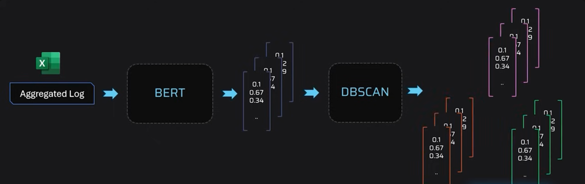
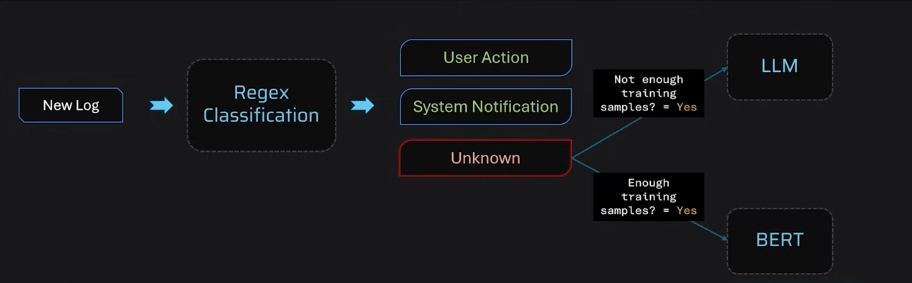
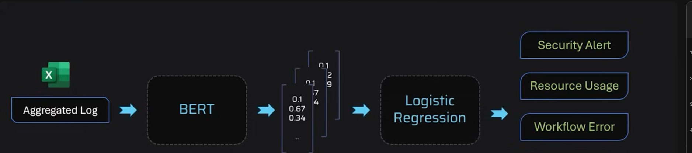
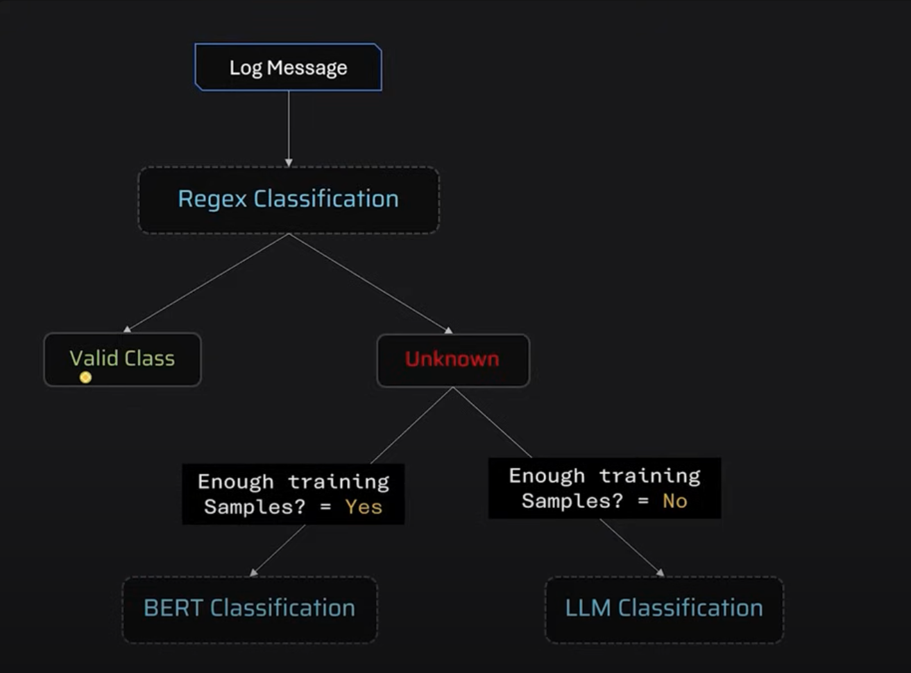
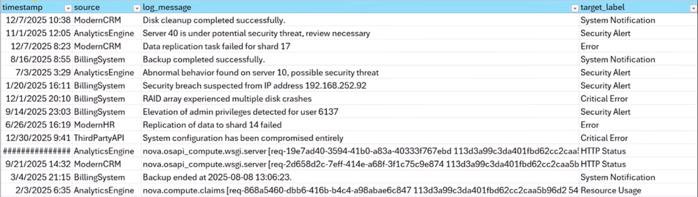

# nlp-log-classification-project
Log classification using hybrid classification system

# Log Classification With Hybrid Classification Framework

This project implements a hybrid log classification system, combining three approaches to handle varying levels of complexity in log patterns. The classification methods ensure flexibility and effectiveness in processing predictable, complex, and poorly-labeled data patterns.

---

## Classification Approaches

1. **Regular Expression (Regex)**:
   - Handles the most simplified and predictable patterns.
   - Useful for patterns that are easily captured using predefined rules.

2. **Sentence Transformer + Logistic Regression**:
   - Manages complex patterns when there is sufficient training data.
   - Utilizes embeddings generated by Sentence Transformers and applies Logistic Regression as the classification layer.

3. **LLM (Large Language Models)**:
   - Used for handling complex patterns when sufficient labeled training data is not available.
   - Provides a fallback or complementary approach to the other methods.









## Dataset




---

## Project Structure

```
├── classify.py                # Main classification logic
├── processor_bert.py          # BERT-based classification
├── processor_llm.py           # LLM-based classification
├── processor_regex.py         # Regex-based classification
├── server.py                  # FastAPI server for file upload and classification
├── requirements.txt           # Python dependencies
├── resources/
│   ├── test.csv               # Example input CSV
│   ├── output.csv             # Example output CSV
│   └── ...
├── training/
│   ├── dataset/
│   │   └── log-classification.ipynb  # Notebook for data exploration
│   └── models/
│       └── log_classifier.joblib     # Saved model
└── myenv/                     # Python virtual environment
```

## Setup
1. **Clone the repository**
2. **Create and activate a virtual environment**
   ```sh
   python3 -m venv myenv
   source myenv/bin/activate
   ```
3. **Install dependencies**
   ```sh
   pip install -r requirements.txt
   ```

## Running the API Server
1. Change directory to where `server.py` is located (e.g., `training/`):
   ```sh
   cd training
   ```
2. Start the FastAPI server:
   ```sh
   uvicorn server:app --reload
   ```

## Using the API
- **Endpoint:** `POST /classify/`
- **Body:** `form-data` with a key `file` (type: File), upload your CSV file.
- **CSV Format:** Must have columns `source` and `log_message`.
- **Response:** Returns a CSV file with an added `target_label` column.

## Example CSV
```
source,log_message
ModernCRM,"IP 192.168.133.114 blocked due to potential attack"
BillingSystem,"User 12345 logged in."
...
```

## Troubleshooting
- If you see errors about missing packages, run `pip install -r requirements.txt` again.
- For file uploads to work with `localhost`, use the Postman Desktop Agent.
- If you see SSL/LibreSSL warnings, consider using a Python build with OpenSSL 1.1.1+ for full compatibility.

## License
MIT License


